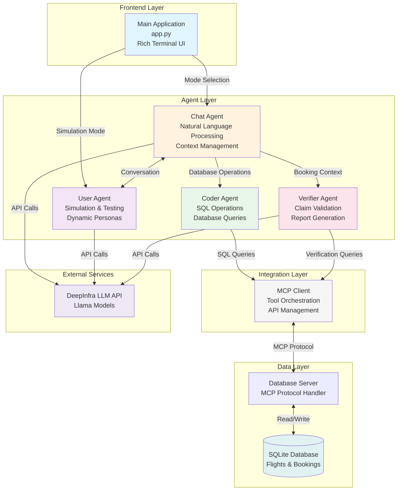

# ✈️ AI Flight Booking System

An intelligent multi-agent flight booking system that combines natural language processing, automated testing, and database verification to provide a robust flight reservation experience.

## 🌟 Features

### 🤖 Multi-Agent Architecture
- **Chat Agent**: Natural conversation interface for flight bookings
- **User Agent**: Simulates realistic user interactions for testing
- **Coder Agent**: Handles database queries and booking operations
- **Verifier Agent**: Validates all booking claims against the database

### 💬 Intelligent Chat Interface
- Natural language understanding for flight searches
- Context-aware conversation tracking
- Automatic booking information extraction
- Professional Rich terminal UI with color-coded responses

### 🧪 Automated Testing
- Realistic user simulation with dynamic personas
- Random booking objective generation
- Comprehensive conversation flow testing
- Success rate analytics and reporting

### ✅ Verification System
- Automatic verification of booking claims
- Database cross-referencing
- Discrepancy detection and reporting
- JSON export of verification results

## 🚀 Quick Start

### Prerequisites
- Python 3.8+
- pip package manager

### Installation

1. Clone the repository:
```bash
git clone https://github.com/yourusername/flight-booking-system.git
cd flight-booking-system
```

2. Install dependencies:
```bash
pip install -r requirements.txt
```

3. Set up your API key:
Create a `.env` file in the project root:
```env
DEEPINFRA_API_KEY=your_api_key_here
```

### Running the Application

#### Interactive Mode (Default)
```bash
python app.py
```

#### Direct Simulation Mode
```bash
python app.py --auto
```

## 📖 Usage Guide

### Mode Selection
Upon starting, you'll be prompted to choose:
1. **Chat Mode** - Interactive conversation with the booking assistant
2. **Simulation Mode** - Automated testing with AI user agent

### Chat Mode Commands
- Type naturally to search for flights
- Say `"thank you, quit"` to exit with booking summary and verification
- Type `"quit"` or `"exit"` for quick exit
- Type `"help"` for available commands

### Example Conversations

#### Booking a Flight
```
You: I need a flight from New York to London next week
Assistant: I'll help you find flights from New York to London...
You: I prefer morning flights in business class
Assistant: Here are the available morning business class flights...
```

#### Ending with Verification
```
You: Thanks, quit
[System generates booking summary]
[System runs verification against database]
[System displays verification report]
```

## 🏗️ Architecture

### System Components



### Detailed System Flow

```
┌────────────────────────────────────────────────────────────────────┐
│                         FLIGHT BOOKING SYSTEM                      │
├────────────────────────────────────────────────────────────────────┤
│                                                                     │
│  ┌──────────────────────────────────────────────────────────────┐ │
│  │                    🖥️  PRESENTATION LAYER                    │ │
│  │                                                              │ │
│  │  ┌────────────────────────────────────────────────────────┐ │ │
│  │  │               Main Application (app.py)                │ │ │
│  │  │  • Rich Terminal UI  • Mode Selection  • Progress Bars │ │ │
│  │  └──────────────┬─────────────────────────────────────────┘ │ │
│  └─────────────────┼────────────────────────────────────────────┘ │
│                    │                                               │
│  ┌─────────────────▼────────────────────────────────────────────┐ │
│  │                    🤖  AGENT ORCHESTRATION                   │ │
│  │                                                              │ │
│  │  ┌─────────────┐  ┌─────────────┐  ┌──────────────────────┐│ │
│  │  │ Chat Agent  │  │ User Agent  │  │   Verifier Agent     ││ │
│  │  │             │◄─►│             │  │                      ││ │
│  │  │ • NLP       │  │ • Simulate  │  │ • Validate Claims    ││ │
│  │  │ • Context   │  │ • Test      │  │ • Check Database     ││ │
│  │  │ • Summary   │  │ • Personas  │  │ • Generate Reports   ││ │
│  │  └──────┬──────┘  └─────────────┘  └──────────┬───────────┘│ │
│  │         │                                      │             │ │
│  │  ┌──────▼───────────────────────────────────────┐           │ │
│  │  │              Coder Agent                     │           │ │
│  │  │  • Execute SQL  • Process Bookings           │           │ │
│  │  │  • Search Flights  • Handle Reservations     │           │ │
│  │  └──────────────────┬───────────────────────────┘           │ │
│  └─────────────────────┼────────────────────────────────────────┘ │
│                        │                                           │
│  ┌─────────────────────▼────────────────────────────────────────┐ │
│  │                    🔧  TOOL INTEGRATION                      │ │
│  │                                                              │ │
│  │  ┌────────────────────────────────────────────────────────┐ │ │
│  │  │                    MCP Client                          │ │ │
│  │  │  • Tool Registration  • Request Handling               │ │ │
│  │  │  • Response Parsing   • Error Management               │ │ │
│  │  └─────────────────────┬──────────────────────────────────┘ │ │
│  └────────────────────────┼─────────────────────────────────────┘ │
│                           │                                        │
│  ┌────────────────────────▼─────────────────────────────────────┐ │
│  │                    💾  DATA PERSISTENCE                      │ │
│  │                                                              │ │
│  │  ┌───────────────────────┐  ┌─────────────────────────────┐ │ │
│  │  │   Database Server      │  │     SQLite Database         │ │ │
│  │  │                        │◄─►                             │ │ │
│  │  │  • MCP Protocol        │  │  • Flights Table           │ │ │
│  │  │  • Query Execution     │  │  • Bookings Table          │ │ │
│  │  │  • Transaction Mgmt    │  │  • Users Table             │ │ │
│  │  └───────────────────────┘  └─────────────────────────────┘ │ │
│  └───────────────────────────────────────────────────────────────┘ │
│                                                                     │
│  ┌───────────────────────────────────────────────────────────────┐ │
│  │                    ☁️  EXTERNAL SERVICES                     │ │
│  │                                                              │ │
│  │  ┌────────────────────────────────────────────────────────┐ │ │
│  │  │              DeepInfra LLM API                         │ │ │
│  │  │  • Llama-3.1 Models  • Natural Language Understanding  │ │ │
│  │  └────────────────────────────────────────────────────────┘ │ │
│  └───────────────────────────────────────────────────────────────┘ │
│                                                                     │
└────────────────────────────────────────────────────────────────────┘
```

### Agent Responsibilities

#### Chat Agent (`agents/chat/`)
- Manages user conversations
- Extracts booking information using LLM
- Maintains conversation context
- Generates booking summaries

#### User Agent (`agents/user/`)
- Simulates realistic user behavior
- Generates random booking objectives
- Tests system robustness
- Provides natural conversation flow

#### Coder Agent (`agents/coder/`)
- Executes database queries
- Handles booking operations
- Manages flight searches
- Processes reservations

#### Verifier Agent (`agents/verifier/`)
- Validates booking claims
- Cross-references with database
- Identifies discrepancies
- Generates verification reports

## 📊 Database Schema

The system uses SQLite with the following main tables:

### Flights Table
- `flight_id`: Unique identifier
- `origin`: Departure city
- `destination`: Arrival city
- `departure_date`: Flight date
- `price`: Ticket price
- `available_seats`: Remaining capacity

### Bookings Table
- `booking_id`: Unique identifier
- `flight_id`: Reference to flight
- `passenger_name`: Traveler name
- `booking_date`: Reservation timestamp
- `status`: Booking status

## 🔧 Configuration

### Agent Configuration Files
Each agent has a `config.yaml` file in its directory:
- `agents/chat/config.yaml` - Chat agent settings
- `agents/user/config.yaml` - User simulation settings
- `agents/verifier/config.yaml` - Verification parameters

### Model Configuration
The system uses DeepInfra API with configurable models:
- Default: `meta-llama/Llama-3.1-8B-Instruct`
- Adjustable temperature and token limits
- Customizable system prompts

## 📝 Output Files

The system generates various output files:

- `booking_summary_[timestamp].txt` - Chat session summaries
- `booking_verification_[timestamp].json` - Verification reports
- `simulation_report_[timestamp].json` - Test results
- `simulation_verification_[timestamp].json` - Simulation verification

## 🛠️ Development

### Project Structure
```
flight-booking-system/
├── app.py                 # Main application with Rich UI
├── agents/
│   ├── chat/             # Chat agent module
│   ├── user/             # User simulation agent
│   ├── coder/            # Database operations agent
│   └── verifier/         # Verification agent
├── mcp-client/           # MCP client for tool calling
├── mcp-server/           # Database server
├── database/             # SQLite database files
├── .env                  # Environment variables
└── requirements.txt      # Python dependencies
```

### Adding New Features
1. Extend agent capabilities in respective modules
2. Update configuration files as needed
3. Modify UI components in `app.py`
4. Add new verification rules in verifier agent

## 🤝 Contributing

Contributions are welcome! Please feel free to submit a Pull Request.

1. Fork the repository
2. Create your feature branch (`git checkout -b feature/AmazingFeature`)
3. Commit your changes (`git commit -m 'Add some AmazingFeature'`)
4. Push to the branch (`git push origin feature/AmazingFeature`)
5. Open a Pull Request

## 📄 License

This project is licensed under the MIT License - see the LICENSE file for details.

## 🙏 Acknowledgments

- Built with [Rich](https://github.com/Textualize/rich) for beautiful terminal UI
- Powered by [DeepInfra](https://deepinfra.com/) for LLM capabilities
- Uses MCP (Model Context Protocol) for tool integration

## 📞 Support

For issues, questions, or suggestions, please open an issue on GitHub.

---

**Made with ❤️ by the AI Flight Booking Team**